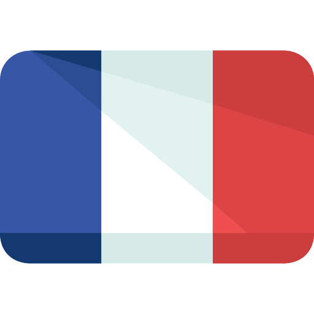

# Dog's Matcha

### Français :

**Dog's Matcha** est un projet qui a pour but de concevoir une application de site de rencontres pour chiens. 

L'application permet à un utilisateur représentant son chien de s’inscrire et de renseigner ses détails personnels et ses préférences dans l’autre, en vue de pouvoir matcher un autre utilisateur ayant un profil plus ou moins correspondant, parmi une sélection de profils d’autres utilisateurs que le site proposera.

Une fois qu’ils se sont réciproquement matchés (en l'occurrence se sont mutuellement "liké"), ces deux profils pourront échanger via un chat privé.

Un script (faker_seeds.php) fournit une "seed" hydratant la base de données avec un ensemble d'environ 1000 faux profils, correctement renseignés qui servira à tester l’optimisation du site.

**Dog's Matcha** a été dévellopé en:

>- PHP pour le back-end
>- HTML, CSS, Bootstrap, Javascript pour le front-end, ainsi que Twig pour moteur de template.
>- Javascript pour le chat et notification en temps réel.

  

### English :

**Dog's Matcha** is a project that aims to design a dating site application for dogs. 

The application allows a user representing his dog to register and fill in his personal details and preferences in the other one, in order to be able to match another user with a more or less matching profile, among a selection of profiles of other users that the site will propose.

Once they have matched each other (in this case "liked" each other), these two profiles will be able to exchange via private chat.

A script (faker_seeds.php) provides a "seed" hydrating the database with a set of about 1000 fake profiles, correctly filled in, which will be used to test the optimization of the site.

**Dog's Matcha** was developed in:

>- PHP for the back-end
>- HTML, CSS, Bootstrap, Javascript for the front-end, as well as Twig for template engine.
>- Javascript for chat and real-time notification.

  

***

   

## Présentation - Presentation:

 L’application permet à un utilisateur de s’inscrire, et une fois l’inscription validée, un e-mail de confirmation comportant un lien unique est envoyé sur l’adresse e-mail renseignée afin de valider son inscription.  Il peut recevoir un mail de réinitialisation de son mot de passe en cas d’oubli.

 The application allows a user to register, and once the registration has been validated, a confirmation e-mail with a unique link is sent to the e-mail address provided in order to validate the registration.  The user can receive an email to reset his password in case he has forgotten it.

***

***

***

 Une fois inscrit et connecté, l'utilisateur est invité à compléter le profil de son chien, en rajoutant des informations telles qu'une photo de profil, son nom, que son âge, sa race, son adresse (afin d'être géolocalisé via une API), ses caractéristiques (illustrés par des hashtags), etc...

 Once registered and logged in, the user is invited to complete his dog's profile, adding information such as a profile picture, his name, age, breed, address (in order to be geolocated via an API), characteristics (illustrated by hashtags), etc...

***

***

 Une fois connecté, l'utilisateur se voit proposer via un algorithme une liste de suggestions de profils qui lui correspondent, du match total au match plus ou moins partiel.

la liste des suggestions est triable par âge (ordre croissant), localisation (du plus proche géographiquement au moins proche), popularité (du plus liké au moins liké) et tags en commun (du plus correspondant au moins correspondant). 

L’utilisateur peut effectuer une recherche avancée en sélectionnant un ou plusieurs critères tels qu'un intervalle d’âge, une race en particulier, une localisation particulière (la ville), un intervalle de popularité et par un tag en particulier.
Tout comme la liste de suggestion, la recherche avancée est triable par âge, localisation, popularité et par tags.

 Once logged in, the user is offered via an algorithm a list of profile suggestions that correspond to him, from the total match to the more or less partial match.

The list of suggestions is sortable by age (ascending order), location (from the closest geographically to the least close), popularity (from the most liked to the least liked) and common tags (from the most matching to the least matching). 

The user can perform an advanced search by selecting one or more criteria such as an age interval, a particular race, a particular location (the city), a popularity interval and by a particular tag.
Like the suggestion list, the advanced search is sortable by age, location, popularity and by tags.

***

***

 Un utilisateur peut consulter le profil des autres utilisateurs, et peut également :

>- "Liker" ou "unliker" un autre utilisateur
>- Voir que le profil visité a déjà "liké" l’utilisateur
>- Consulter le score de popularité (nombre de likes).
>- Voir si l’utilisateur est en ligne, et si ce n’est pas le cas, afficher la date de sa dernière visite.
>- Reporter l’utilisateur comme étant un "faux compte".
>- Bloquer l’utilisateur. Un utilisateur bloqué n'apparaît ensuite plus dans les résultats de recherche, et ne génère plus de notifications.

 A user can view the profiles of other users, and can also :

>- "Like" or "unlike" another user
>- See that the visited profile has already "liked" the user
>- Check the popularity score (number of likes).
>- See if the user is online, and if not, display the date of his last visit.
>- Report the user as a "fake account".
>- Block the user. A blocked user will then no longer appear in search results, and will no longer generate notifications.

***

***

 Si les deux uilisateurs se sont mutuellement likés, ils sont considérés comme avoir "matché" et peuvent ainsi échanger via un chat en temps réel.
Si l'un des deux "unlike" l'autre, ou le bloque, ils ne matchent plus.

 If the two users have liked each other, they are considered to have "matched" and can thus exchange via a real-time chat.
If one of the two "unlike" the other, or blocks the other, they no longer match.

***

***

 Un utilisateur est notifié, en temps réel des évènements suivants :

>- L’utilisateur a reçu un "like".
>- L’utilisateur a reçu une visite.
>- L’utilisateur a reçu un message.
>- Un utilisateur "liké" a "liké" en retour.
>- Un utilisateur matché ne vous “like” plus.

L’utilisateur peut voir, de n’importe quelle page, qu’une notification n’a pas été lue.

 A user is notified, in real time, of the following events:

>- The user has received a "like".
>- The user has received a visit.
>- The user has received a message.
>- A user "liked" has "liked" back.
>- A "liked" user no longer "like" you.

The user can see, from any page, that a notification has not been read.

***

 Quand un utilisateur regarde un profil, il apparaît dans l’historique des visites de ce dernier.

 When a user looks at a profile, it appears in the profile's visit history.

***

 À tout moment, l’utilisateur peut consulter et modifier ses informations et son mot de passe, ainsi que les informations concernant son chien.

 At any time, the user can consult and modify his information and password, as well as the information concerning his dog.

***

 Tout le site est responsive.

 The whole site is responsive.

***
